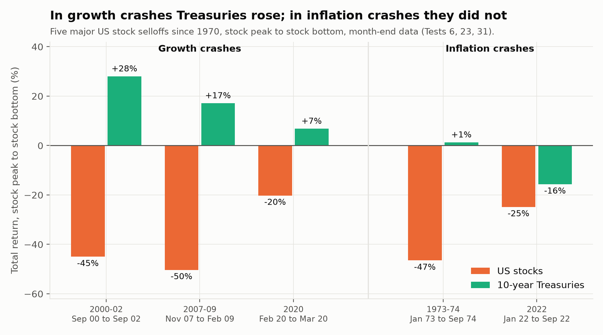
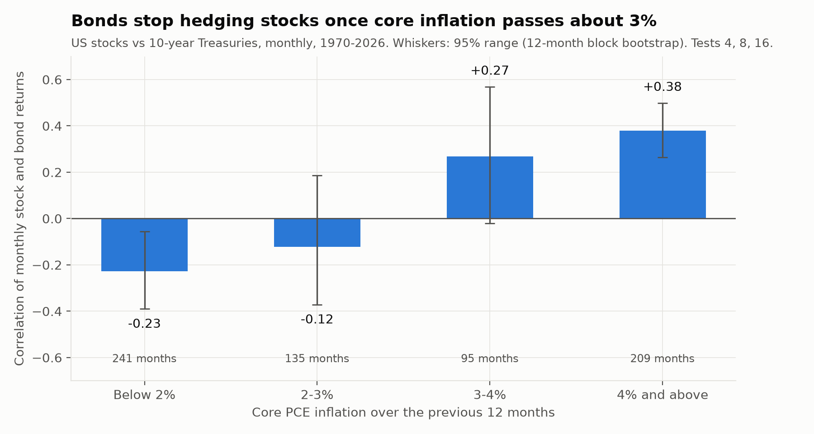
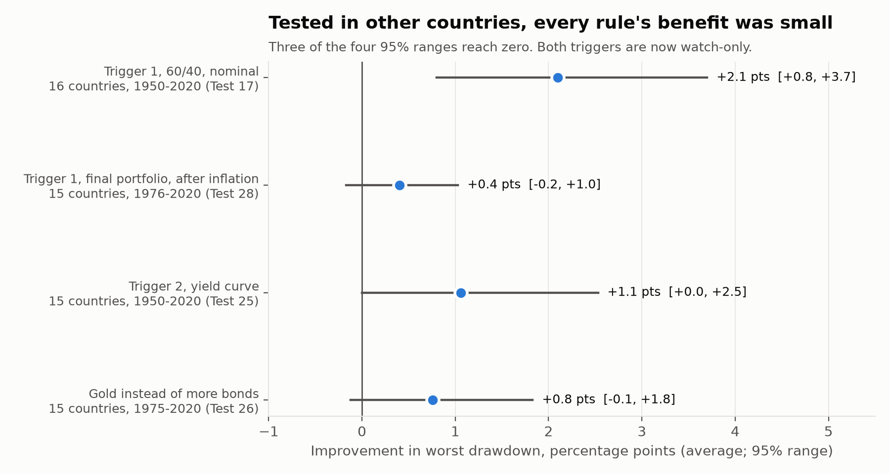
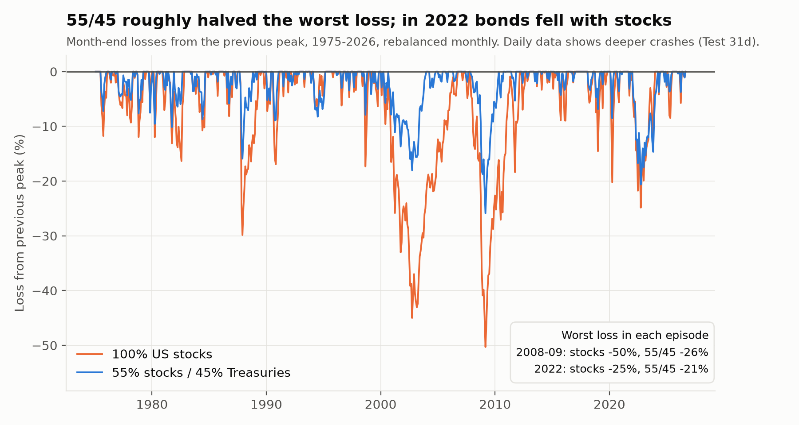
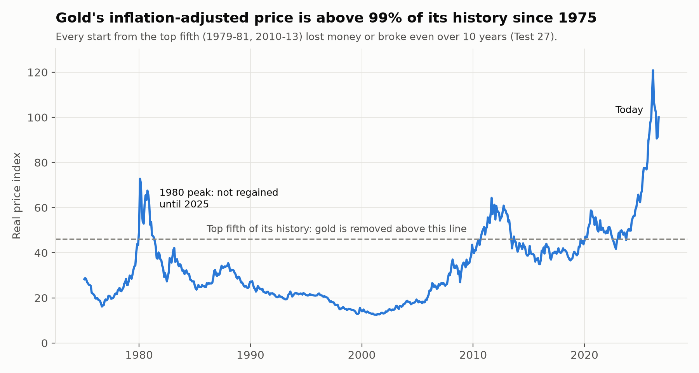

# Project Swim

Self-directed investment research project, built alongside CFA Level II study. A concentrated multi-asset model portfolio — full bottom-up underwriting, top-down asset allocation, and an options hedging overlay — tracked monthly with real discipline, not a one-off stock pitch.

**Named for the old idea of throwing a kid in the deep end to teach them to swim.** This project is deliberately structured to force real learning under real (if simulated) stakes, not just studying the concepts in the abstract.

## Phase 2 in one paragraph: the top-down allocation

Since the 1950s, the main threat to a diversified portfolio without leverage has been a shift to inflation-driven markets, when stocks and bonds fall together. I tested whether I could time that shift, with growth and inflation quadrants, an inflation trigger and a yield-curve trigger, and none survived every out-of-sample test I set before running it. So the portfolio does not try. It holds **55% stocks and 45% intermediate Treasuries**, which roughly halved the worst loss in 2008-type crashes, and it accepts that bonds will not protect it in an inflation shock like 2022. Position limits control the risk of holding few stocks. I watch core inflation, the yield curve and gold's price every month, and a rule comes back only if its forward record earns it.

### What survived testing

Each rule was built on US data, given pass/fail criteria before it ran, compared against random timing, and then tested on 15 other countries.

| Rule | US result | Other countries | Status |
|---|---|---|---|
| Hold a fixed stock/bond mix | Worst loss cut from -50% to about -26% | Same pattern after 1950 | **Kept** (the core) |
| Bonds hedge stocks when inflation is low | Correlation -0.23 below 2% inflation, +0.38 above 4% | Higher at high inflation in 14 of 16 countries | **Kept** (the core finding) |
| Trade growth/inflation quadrants | No better than random | Not tested | Dropped |
| Trigger 1: trim bonds into cash at high inflation | Helped in 2022 and the 1970s, not in the worst drawdown | Gain not distinguishable from zero after inflation | **Watch-only** |
| Trigger 2: cut stocks when the yield curve inverts | Passed on a second attempt | Failed: 57 of 76 inversions were false alarms | **Watch-only** |
| Hold gold as a diversifier | Near-zero correlation; as good as Treasuries | Correlation held | Removed for valuation (re-entry rule) |
| Tilt toward inflation-winning sectors | Picks did not hold up out of sample | Not tested | Dropped |

### The decisions

| Decision | Main evidence | Tests |
|---|---|---|
| 55% stocks / 45% intermediate Treasuries, static | The most stocks whose drawdown, with a concentrated stock sleeve, stays within a plain 60/40's (-27.9% vs -29.0%) | 24, 32d |
| No market timing | Every timing rule was worth about 2 points of drawdown at most, and none passed every out-of-sample test | 1-3, 17, 25, 28 |
| No gold today | Its real price is above 99% of its history; every start from the top fifth lost money or broke even over 10 years | 27 |
| Position limits: at least 6 stocks, max 12% per stock, max 20% per sector | 55% stocks passes the risk bar by only about a point, so sizing is the risk control | 24, red-team |
| Benchmark: 55% VTI / 45% IEF | Matches the allocation; fixed weights | — |

Three decisions were reversed during Phase 2, each by a rule set before the test that reversed it. See the [decision log](docs/decision_log.md).

## How the research is run

1. **Rules before results.** Every test states its metric, its pass/fail rule and a prediction before it runs. The test script is committed to GitHub before it is run, and its results in a separate commit afterwards, so the timestamps show the order. (This started 2026-10-07; earlier tests were committed together with their results.)
2. **Beat luck, not just the baseline.** Timing rules are compared against the same rule with its timing shifted at random.
3. **Out of sample.** Rules built on US data are retested on 15 other countries (Jordà-Schularick-Taylor Macrohistory Database).
4. **Follow the rule when it hurts.** Trigger 2, Trigger 1 and gold were all removed by rules set in advance, after earlier tests had kept them.
5. **Check the data.** Test 31 compared every estimated series with an investable one and replaced the ones that failed.

Full test log, grouped by question: [docs/phase2_tests.md](docs/phase2_tests.md). Predictions made before each test, scored: [docs/predictions.md](docs/predictions.md).

## Portfolio rules (current)

- **Allocation:** 55% stocks, 45% intermediate (7 to 10-year) Treasuries, rebalanced monthly.
- **Position limits:** at least 6 stocks; no stock above 12% of the portfolio; no sector above 20%; with fewer than 6 stocks, the stock sleeve drops to 50%.
- **Benchmark:** 55% VTI (total US stock market) + 45% IEF (7–10-year Treasuries), total return, rebalanced monthly.
- **Monthly review (first of each month, before looking at performance):** core PCE, the 12- and 24-month stock-bond correlation, the yield-curve spread, gold's real-price percentile, and what each watch-only rule would do. Gold returns at 5% when its real price leaves the top fifth of its 1975–present history.
- **Rule freeze:** no new rules or threshold changes until 2027-10-08, except changes the existing rules trigger (decided 2026-10-08). The 12 monthly records in between are the forward test.

## What this does not show

- **Few independent episodes.** The inflation evidence rests mainly on the 1970s to early 1980s and 2021 to 2023, plus similar periods abroad.
- **Remaining data limits.** Bond returns before 2002 are estimated (and overstate losses); gold before 2004 uses monthly averages; cross-country data is annual; month-end data understates crashes (2020: -17.5% daily vs -7.8% month-end). Everything is in-sample except the cross-country tests.
- **Concentration.** Single stocks were approximated with industry portfolios, which understate their risk.
- **Options.** The overlay was tested only on index benchmarks from 2008 (Cboe PPUT and CLL), not on single-stock options.

## Status

🟡 **Phase 2 complete** (Tests 1–32). Next: crisis and bubble research (2001, 2008, 2022 and the current AI boom), then Phase 3 stock selection. The original 2026-10-22 checkpoint will move.

## Repository

- `scripts/phase2_macro/` — Phase 2 tests. `run_all.py` reproduces them: `python scripts/phase2_macro/run_all.py` (Tests 27–32 and charts) or `--all` (Tests 1–32). Run from the repo root with a free FRED API key in a git-ignored `.env` file as `FRED_API_KEY=...`.
- `data/phase2_macro/` — cached source files and test outputs (`*_results.txt`).
- `docs/` — test log, decision log, figures.
- `research/`, `models/`, `dashboard/` — Phase 3 onward.

## Disclaimer

This is an educational, self-directed project. Nothing here is investment advice. The portfolio is paper-traded/simulated — no real client money is involved.

## License

MIT — see `LICENSE`.
